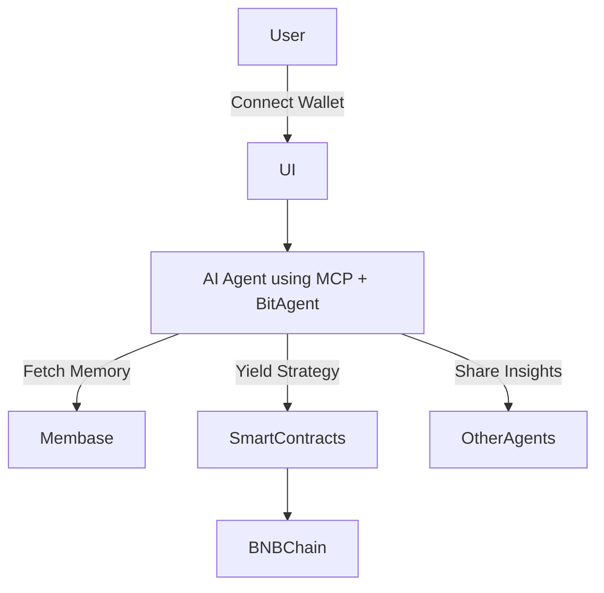

# AION – The Immortal AI DeFi Agent

## Overview

AION is an on-chain immortal AI agent on BNBChain that optimizes DeFi yield strategies using autonomous decision-making, decentralized memory via Membase, and cross-agent interoperability via BitAgent.

---

## Tech Stack

- **Blockchain:** BNBChain
- **AI Layer:** BitAgent + Membase + MCP
- **Frontend:** Astro + Bun + TailwindCSS
- **Smart Contracts:** Solidity + Foundry
- **Interoperability:** MCP & cross-agent messaging

---

## Folder Structure

```

AION\_AI\_Agent/
├── contracts/           # Solidity smart contracts (Foundry)
├── frontend/            # Astro frontend using Bun
│   ├── public/
│   ├── src/
│   │   ├── components/
│   │   ├── pages/
│   │   ├── styles/
│   │   └── utils/
├── mcp\_agent/           # MCP-based AI Agent (Node.js)
├── docs/                # Diagrams, flowcharts, and extra docs

```

---

## Flowchart (MVP)



---

## 🚀 Setup Instructions

### 1. Frontend (Astro + Bun)

```bash
cd frontend
bun install
bun dev
```

---

### 2. Smart Contracts (Foundry)

```bash
cd contracts
forge build
forge test -vvvv
```

---

### 3. MCP Agent

```bash
cd mcp_agent
npm install
node index.js
```

---

## ✅ Features Implemented

- [x] Astro Frontend with Launch UI
- [x] AIONVault Smart Contract (Deposit, Withdraw)
- [x] Foundry Test Coverage
- [x] Project structure ready for deployment
- [ ] (WIP) MCP Agent integration with Membase

---

## 🧠 Author

Built with 💙 by **Samar Abdelhameed**
[GitHub](https://github.com/samarabdelhameed) • AI & Blockchain Engineer

---

## License

MIT © 2025

```

```
