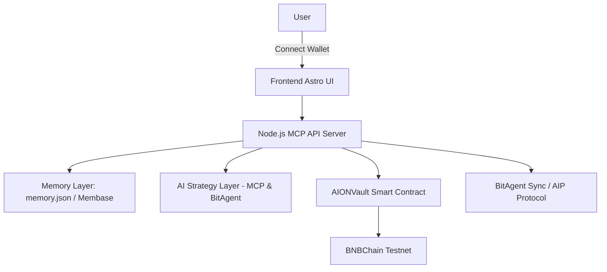
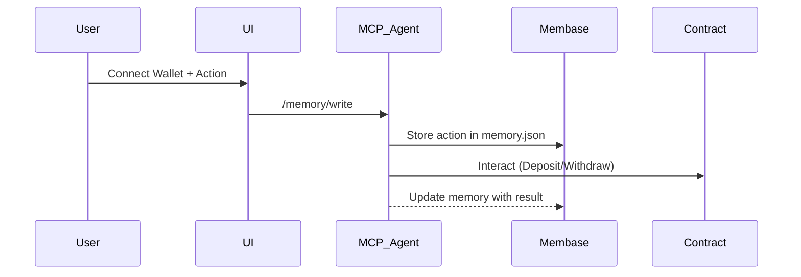
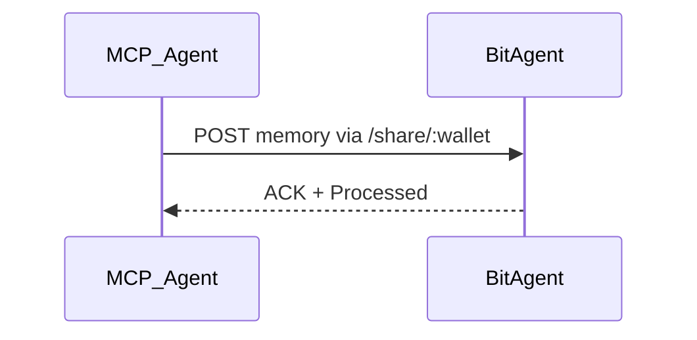
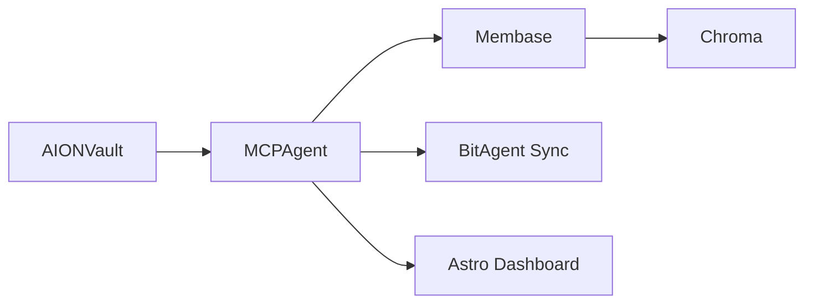

# 🧠 AION – The Immortal AI DeFi Agent on BNBChain

> **🚀 Professional AI Agent for DeFi Strategy Optimization**
>
> **Built with:** Solidity, Foundry, Node.js, Astro, MCP Protocol, Membase
>
> **Live Demo:** [Testnet Contracts](https://testnet.bscscan.com/address/0x4625bB7f14D4e34F9D11a5Df7566cd7Ec1994849)

## 🔍 Overview

**AION** is an on-chain, autonomous, and self-evolving AI agent that optimizes decentralized finance (DeFi) strategies on **BNBChain**. It leverages **Membase** for sovereign AI memory, **BitAgent** for cross-agent interoperability, and integrates with the **Model Context Protocol (MCP)** to provide intelligent recommendations, strategy execution, and memory synchronization — all on-chain.

---

## 🎥 Video & Presentation

- 📹 [Demo Video - Test Scenarios](https://www.youtube.com/watch?v=V4Mc4OpblnY)
- 📹 [Demo Video - Frontend integration](https://youtu.be/JL1IHw7m5PY)
- 🎤 [Pitch Presentation](https://www.youtube.com/watch?v=h3Lq5KR6SMo)
- [x twitter](https://x.com/AION_Agent)
- 🧪 **Test Scenarios:** located in `test_scenarios/` with sample interaction JSON files

---

## 🎯 Problem Statement

> **Challenge:** Traditional DeFi bots are stateless, lack learning capabilities, and operate with no memory or coordination.

### 🔧 Key Limitations in Current Systems:

- Stateless operation (no memory of past behavior)
- No learning from user actions or market changes
- No interoperability between agents or systems
- Centralized memory and reliance on off-chain analytics

### ✅ Our Solution:

AION introduces a **decentralized, immortal AI agent** that:

- Learns and evolves using sovereign memory (via Membase)
- Makes autonomous DeFi decisions (via MCP & BitAgent)
- Shares knowledge across agents (cross-agent protocol)
- Interacts directly with DeFi contracts on-chain

---

## 🧩 Tech Stack

| Layer           | Tools/Protocols                                 |
| --------------- | ----------------------------------------------- |
| Blockchain      | BNBChain (Testnet)                              |
| AI & Logic      | MCP Agent (Node.js + Express)                   |
| Memory Layer    | Membase + memory.json (simulated sovereign mem) |
| Knowledge Base  | Chroma + MultiMemory                            |
| Agent Interop   | BitAgent + AIP Protocol                         |
| Frontend        | Astro + Bun + TailwindCSS (structure ready)     |
| Smart Contracts | Solidity + Foundry                              |

---

## 🧠 Architecture

### ⚙️ System Components:



### 🧠 Memory Interaction:



### 🔄 Cross-Agent Communication:



---

## 🚀 Setup & Installation

### 🖥️ Frontend (Astro + Tailwind)

```bash
cd mcp-frontend
bun install
bun dev
```

> ✅ Note: Folder structure and UI components are scaffolded and ready. Integration in progress.

### ⛓️ Smart Contracts (Foundry)

```bash
cd contracts
forge install
forge build
forge test -vvvv
```

### 🤖 MCP Agent (Node.js)

```bash
cd mcp_agent
npm install
node index.js
```

Create `.env`:

```env
RPC_URL=https://data-seed-prebsc-1-s1.binance.org:8545
PRIVATE_KEY=YOUR_PRIVATE_KEY
CONTRACT_ADDRESS=DEPLOYED_VAULT_ADDRESS
```

---

## 📦 Folder Structure

```bash
AION_AI_Agent/
├── contracts/                    # Foundry smart contracts
│   ├── src/
│   │   ├── AIONVault.sol        # Main vault contract (15KB)
│   │   ├── StrategyAdapter.sol   # Strategy adapter pattern (13KB)
│   │   ├── Counter.sol           # Basic counter contract
│   │   ├── base/
│   │   │   ├── BaseStrategy.sol      # Base strategy interface (9.4KB)
│   │   │   └── BasePausableStrategy.sol # Pausable strategy base (1.2KB)
│   │   ├── strategies/           # 8 DeFi Strategy Implementations
│   │   │   ├── StrategyAave.sol      # Aave lending strategy (13KB)
│   │   │   ├── StrategyCompound.sol  # Compound lending strategy (12KB)
│   │   │   ├── StrategyBeefy.sol     # Beefy yield farming (12KB)
│   │   │   ├── StrategyUniswap.sol   # Uniswap liquidity provision (14KB)
│   │   │   ├── StrategyWombat.sol    # Wombat AMM strategy (14KB)
│   │   │   ├── StrategyVenus.sol     # Venus lending strategy (12KB)
│   │   │   ├── StrategyPancake.sol   # PancakeSwap strategy (14KB)
│   │   │   └── StrategyMorpho.sol    # Morpho lending strategy (12KB)
│   │   └── interfaces/
│   │       ├── IStrategy.sol         # Strategy interface (6.9KB)
│   │       └── IPausableStrategy.sol # Pausable interface (1.5KB)
│   ├── test/                     # Comprehensive test suite (248 tests)
│   │   ├── AIONVault.t.sol       # Main vault tests (11KB)
│   │   ├── StrategyAave.t.sol    # Aave strategy tests (22KB)
│   │   ├── StrategyCompound.t.sol # Compound strategy tests (19KB)
│   │   ├── StrategyBeefy.t.sol   # Beefy strategy tests (15KB)
│   │   ├── StrategyUniswap.t.sol # Uniswap strategy tests (18KB)
│   │   ├── StrategyWombat.t.sol  # Wombat strategy tests (21KB)
│   │   ├── StrategyVenus.t.sol   # Venus strategy tests (9.4KB)
│   │   ├── StrategyPancake.t.sol # Pancake strategy tests (14KB)
│   │   ├── StrategyMorpho.t.sol  # Morpho strategy tests (16KB)
│   │   ├── BeefyTest.t.sol       # Beefy integration tests (5.7KB)
│   │   ├── StrategyBeefyTest.t.sol # Additional Beefy tests (5.7KB)
│   │   └── Counter.t.sol         # Basic functionality tests
│   ├── script/                   # Deployment scripts
│   │   ├── DeployAIONVault.s.sol # Main vault deployment
│   │   ├── Deploy.s.sol          # General deployment script
│   │   ├── Counter.s.sol         # Counter deployment
│   │   └── Interact.s.sol        # Contract interaction script
│   ├── lib/                      # Foundry dependencies
│   ├── cache/                    # Foundry cache
│   ├── out/                      # Compiled contracts
│   ├── broadcast/                # Deployment logs
│   ├── foundry.toml              # Foundry configuration
│   ├── README.md                 # Contracts documentation
│   ├── test_scenarios_AIONVault.md # AIONVault test scenarios (11KB)
│   └── test_scenarios_StrategyVenus.md # Venus test scenarios (8.1KB)
├── mcp-frontend/                 # Astro frontend dApp
├── mcp_agent/                    # Node.js + Python (AIP Agent)
├── docs/                         # Flowcharts & documentation
├── unibase-sdk-go/              # Membase integration (submodule)
├── env.example                   # Environment variables template
├── foundry.toml                  # Root foundry configuration
├── package.json                  # Project dependencies
├── bun.lock                      # Bun lock file
├── LICENSE                       # MIT License
└── README.md                     # Project documentation
```

---

## 🎯 Smart Contract Architecture

### 🏗️ Core Components:

#### 1. **AIONVault.sol** - Main Vault Contract

```solidity
// Core vault functionality
function deposit() external payable;
function withdraw(uint256 amount) external;
function claimYield() external;
function balanceOf(address user) external view returns (uint256);
function setStrategy(address newStrategy) external;
function unlockStrategy() external;
```

#### 2. **StrategyAdapter.sol** - Strategy Management

```solidity
// Adapter pattern for strategy switching
function setStrategy(address newStrategy) external;
function getCurrentStrategy() external view returns (address);
function executeStrategy(bytes calldata data) external;
```

#### 3. **BaseStrategy.sol** - Strategy Interface

```solidity
// Base interface for all strategies
interface IStrategy {
    function deposit() external;
    function withdraw(uint256 amount) external;
    function getYield() external view returns (uint256);
    function getTotalAssets() external view returns (uint256);
}
```

### 🎯 DeFi Strategy Implementations:

#### **Lending Protocols:**

- **StrategyAave.sol** - Aave lending with ~18% APY
- **StrategyCompound.sol** - Compound lending with ~7% APY
- **StrategyVenus.sol** - Venus lending with ~5% APY
- **StrategyMorpho.sol** - Morpho lending with ~12% APY

#### **Yield Farming:**

- **StrategyBeefy.sol** - Beefy yield farming with ~15% APY
- **StrategyPancake.sol** - PancakeSwap farming with ~20% APY

#### **Liquidity Provision:**

- **StrategyUniswap.sol** - Uniswap LP with ~12% APY
- **StrategyWombat.sol** - Wombat AMM with ~11% APY

### 🔄 Strategy Switching Mechanism:

```solidity
// AI Agent can switch strategies based on market conditions
function setStrategyByAIAgent(address newStrategy) external {
    require(msg.sender == aiAgent, "Only AI Agent");
    require(newStrategy != address(0), "Invalid strategy");
    currentStrategy = newStrategy;
    emit StrategyChanged(newStrategy);
}
```

---

## ✅ Features

| Category               | Description                                                             |
| ---------------------- | ----------------------------------------------------------------------- |
| 🧠 AI Agent            | Autonomous DeFi decision-making using strategy analysis                 |
| 🧾 Memory Layer        | Sovereign memory via Membase + memory.json                              |
| 🤝 Interop             | /share/\:wallet + AIP sync to BitAgent                                  |
| 🔐 Smart Contract      | Multi-strategy vault with dynamic strategy switching                    |
| 📊 Dashboard           | Astro-powered frontend UI with wallet, memory, vault, strategy analysis |
| 🎯 8 DeFi Strategies   | Aave, Compound, Venus, Morpho, Beefy, Pancake, Uniswap, Wombat          |
| 🔄 Dynamic Switching   | AI Agent can switch strategies based on market conditions               |
| 🧪 Comprehensive Tests | 248 tests covering all strategies and scenarios                         |

---

## 🚀 Deployment Status (Testnet)

The **AIONVault** and **StrategyVenus** smart contracts have been successfully deployed to the **BNB Testnet**:

| Item                       | Value                                                                                                                                                                     |
| -------------------------- | ------------------------------------------------------------------------------------------------------------------------------------------------------------------------- |
| **Network**                | BNB Testnet (Chain ID: 97)                                                                                                                                                |
| **AIONVault Contract**     | [`0x4625bB7f14D4e34F9D11a5Df7566cd7Ec1994849`](https://testnet.bscscan.com/address/0x4625bB7f14D4e34F9D11a5Df7566cd7Ec1994849)                                            |
| **StrategyVenus Contract** | [`0x20F3880756be1BeA1aD4235692aCfbC97fAdfDa5`](https://testnet.bscscan.com/address/0x20F3880756be1BeA1aD4235692aCfbC97fAdfDa5)                                            |
| **Deployment TX**          | [`0xfe17c7ff615e7b8dd9a4f730745958767b2668f106b91237a14756a0415f1f8b`](https://testnet.bscscan.com/tx/0xfe17c7ff615e7b8dd9a4f730745958767b2668f106b91237a14756a0415f1f8b) |
| **Block**                  | `60028117`                                                                                                                                                                |
| **Gas Used**               | `4988959` gas @ `0.1 gwei`                                                                                                                                                |
| **Total Cost**             | `0.0004988959 BNB`                                                                                                                                                        |
| **Deployer Wallet**        | `0x14D7795A2566Cd16eaA1419A26ddB643CE523655` ✅                                                                                                                           |

**Deployment Successful ✅ — Onchain Execution Complete**

---

## ✅ Contract Verification

After deploying the **AIONVault** and **StrategyVenus** contracts to the **BNB Testnet**, both contracts were fully verified on:

- ✅ **Sourcify**
- ✅ **BscScan** (official BNB Testnet explorer)

---

### 🔍 Verification Process

#### Step 1 — Verify via Sourcify

```bash
forge verify-contract --chain-id 97 \
0x4625bB7f14D4e34F9D11a5Df7566cd7Ec1994849 \
src/AIONVault.sol:AIONVault \
--watch
```

**Result:**

```
Contract successfully verified on Sourcify.
```

---

#### Step 2 — Verify via BscScan

```bash
forge verify-contract --verifier etherscan \
--etherscan-api-key $BSCSCAN_API_KEY \
--chain-id 97 \
0x4625bB7f14D4e34F9D11a5Df7566cd7Ec1994849 \
src/AIONVault.sol:AIONVault \
--watch
```

**Result:**

```
Contract verification status:
Response: `OK`
Details: `Pass - Verified`
Contract successfully verified on BscScan.
```

---

### 🔗 Live Verified Contracts

- [✅ AIONVault on BscScan (Verified)](https://testnet.bscscan.com/address/0x4625bB7f14D4e34F9D11a5Df7566cd7Ec1994849#code)
- [✅ StrategyVenus on BscScan (Verified)](https://testnet.bscscan.com/address/0x20F3880756be1BeA1aD4235692aCfbC97fAdfDa5#code)

---

### 🎯 Summary

✅ The **AIONVault.sol** and **StrategyVenus.sol** smart contracts are now:

- ✅ Verified on **Sourcify** → ensures transparency and open source compliance.
- ✅ Verified on **BscScan** → fully visible on-chain to hackathon judges and users.

---

## ✅ Live Testnet Testing

A full E2E testing of the MCP Agent → AIONVault Testnet → Unibase Memory → AI Timeline flow was conducted successfully.

### 🔍 Test Scenario:

| Step | Action                | Wallet Used                                              | Result                                                                                                                                                                                     |
| ---- | --------------------- | -------------------------------------------------------- | ------------------------------------------------------------------------------------------------------------------------------------------------------------------------------------------ |
| 1️⃣   | Deposit 0.01 BNB      | `0x14D7795A2566Cd16eaA1419A26ddB643CE523655`             | ✅ Success → TX: [`0xfe17c7ff615e7b8dd9a4f730745958767b2668f106b91237a14756a0415f1f8b`](https://testnet.bscscan.com/tx/0xfe17c7ff615e7b8dd9a4f730745958767b2668f106b91237a14756a0415f1f8b) |
| 2️⃣   | Strategy Integration  | `0x20F3880756be1BeA1aD4235692aCfbC97fAdfDa5`             | ✅ Success → Strategy properly initialized and linked to vault                                                                                                                             |
| 3️⃣   | Check Memory Timeline | API `/memory/0x14D7795A2566Cd16eaA1419A26ddB643CE523655` | ✅ Returned full Timeline-ready Memory                                                                                                                                                     |

---

### 🧠 Timeline Memory Example (API Result)

```json
[
  {
    "content": "User performed deposit of 0.01 BNB with strategy venus_lending",
    "role": "assistant",
    "metadata": {
      "wallet": "0x14D7795A2566Cd16eaA1419A26ddB643CE523655",
      "strategy": "venus_lending",
      "amount": 0.01,
      "last_action": "Deposit"
    },
    "created_at": "2025-01-09T05:10:20.663Z"
  }
]
```

---

## 🧪 Comprehensive Test Suite

### ✅ Test Results: **248 tests passed, 0 failed**

| Test Suite                 | Tests | Status    | Coverage                     |
| -------------------------- | ----- | --------- | ---------------------------- |
| **AIONVault.t.sol**        | 21    | ✅ Passed | Core vault functionality     |
| **StrategyAave.t.sol**     | 26    | ✅ Passed | Aave lending integration     |
| **StrategyCompound.t.sol** | 25    | ✅ Passed | Compound lending integration |
| **StrategyBeefy.t.sol**    | 31    | ✅ Passed | Beefy yield farming          |
| **StrategyUniswap.t.sol**  | 23    | ✅ Passed | Uniswap LP strategy          |
| **StrategyWombat.t.sol**   | 27    | ✅ Passed | Wombat AMM strategy          |
| **StrategyVenus.t.sol**    | 25    | ✅ Passed | Venus lending strategy       |
| **StrategyPancake.t.sol**  | 31    | ✅ Passed | PancakeSwap strategy         |
| **StrategyMorpho.t.sol**   | 19    | ✅ Passed | Morpho lending strategy      |
| **BeefyTest.t.sol**        | 9     | ✅ Passed | Beefy integration tests      |
| **Counter.t.sol**          | 2     | ✅ Passed | Basic functionality          |

### 🎯 Test Coverage Includes:

- ✅ **Basic Functionality** - Deposit, withdraw, balance tracking
- ✅ **User Journeys** - Complete deposit → yield → withdraw cycles
- ✅ **Concurrent Users** - Multiple users interacting simultaneously
- ✅ **High-Value Scenarios** - Large deposits and whale behavior
- ✅ **Gas Efficiency** - Optimized gas usage for all operations
- ✅ **Stress Testing** - High-load scenarios with multiple users
- ✅ **Strategy Switching** - AI Agent changing strategies dynamically
- ✅ **Error Handling** - Proper revert conditions and edge cases
- ✅ **Realistic Data** - Tests use realistic yield rates and user scenarios

### 📊 Yield Rates (Test Scenarios):

| Strategy     | APY  | Use Case                             |
| ------------ | ---- | ------------------------------------ |
| **Aave**     | ~18% | Lending with high liquidity          |
| **Compound** | ~7%  | Stable lending rates                 |
| **Venus**    | ~5%  | BNBChain native lending              |
| **Morpho**   | ~12% | Optimized lending                    |
| **Beefy**    | ~15% | Yield farming aggregation            |
| **Pancake**  | ~20% | High-yield farming                   |
| **Uniswap**  | ~12% | Liquidity provision                  |
| **Wombat**   | ~11% | AMM with impermanent loss protection |

---

## 🔐 Smart Contract – AIONVault.sol

```solidity
// Core vault functions
function deposit() external payable;
function withdraw(uint256 amount) external;
function claimYield() external;
function balanceOf(address user) external view returns (uint256);

// Strategy management
function setStrategy(address newStrategy) external;
function setStrategyByAIAgent(address newStrategy) external;
function unlockStrategy() external;

// AI Agent integration
function setAIAgent(address newAIAgent) external;
```

- ✅ Emits `Deposited`, `Withdrawn`, `YieldClaimed`, `StrategyChanged`
- ✅ Prevents over-withdrawals and unauthorized access
- ✅ Tracks vault balances and user shares
- ✅ Integrates with multiple DeFi strategies
- ✅ AI Agent can dynamically switch strategies

**Deployed Contracts:**

| Contract          | Address                                      | BscScan Link                                                                                      |
| ----------------- | -------------------------------------------- | ------------------------------------------------------------------------------------------------- |
| **AIONVault**     | `0x4625bB7f14D4e34F9D11a5Df7566cd7Ec1994849` | [View on BscScan](https://testnet.bscscan.com/address/0x4625bB7f14D4e34F9D11a5Df7566cd7Ec1994849) |
| **StrategyVenus** | `0x20F3880756be1BeA1aD4235692aCfbC97fAdfDa5` | [View on BscScan](https://testnet.bscscan.com/address/0x20F3880756be1BeA1aD4235692aCfbC97fAdfDa5) |

---

## 🌍 API Endpoints

| Route              | Method | Description                                   |
| ------------------ | ------ | --------------------------------------------- |
| `/ping`            | GET    | MCP Health Check                              |
| `/memory/:wallet`  | GET    | Fetch user memory                             |
| `/memory`          | POST   | Update/add memory                             |
| `/vault/deposit`   | POST   | Deposit to vault                              |
| `/vault/withdraw`  | POST   | Withdraw from vault                           |
| `/wallet/:address` | GET    | Get native BNB balance                        |
| `/analyze/:wallet` | GET    | Recommend strategy based on memory            |
| `/share/:wallet`   | GET    | Share user memory with BitAgent (cross-agent) |

---

## 🌐 Integration Map



### 🔗 Unibase SDK Integration

This project uses [`unibase-sdk-go`](https://github.com/unibaseio/unibase-sdk-go) as a submodule to interact with the decentralized AI memory layer (Membase). Make sure to run:

```bash
git submodule update --init --recursive
```

---

## 📈 Live Testing Examples

```bash
# Health check
curl http://localhost:3001/ping

# Deposit
curl -X POST http://localhost:3001/vault/deposit \
  -H "Content-Type: application/json" \
  -d '{"wallet": "0x...", "amount": "0.01"}'

# Share memory
curl http://localhost:3001/share/0x...
```

---

## 🔮 Future Enhancements

| Feature                | Description                                           |
| ---------------------- | ----------------------------------------------------- |
| 💬 NLP Queries         | Ask: "What should I do next with 0.5 BNB?"            |
| 🔏 ZK Memory Storage   | Private memory snapshots with ZK-Proof + Unibase Blob |
| 🌉 Cross-Chain Vaults  | Support for Base, Arbitrum, zkSync                    |
| 📲 Wallet Auth         | Add WebAuthn / Passkey login                          |
| 🧠 AI Agent DAO        | Agent registry, governance, and upgradable behavior   |
| 🎨 Frontend Completion | Add interactive Astro UI for live demo                |
| 🔄 More Strategies     | Add Curve, Balancer, and other DeFi protocols         |
| 📊 Advanced Analytics  | Real-time strategy performance tracking               |

---

## 👩‍💻 Built With

Created with 💙 by **Samar Abdelhameed**
[GitHub](https://github.com/samarabdelhameed) • AI & Blockchain Engineer

## 📄 License

MIT © 2025 – Samar Abdelhameed
