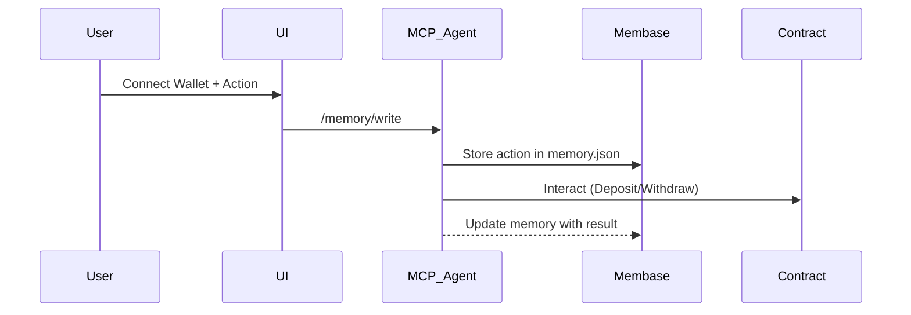
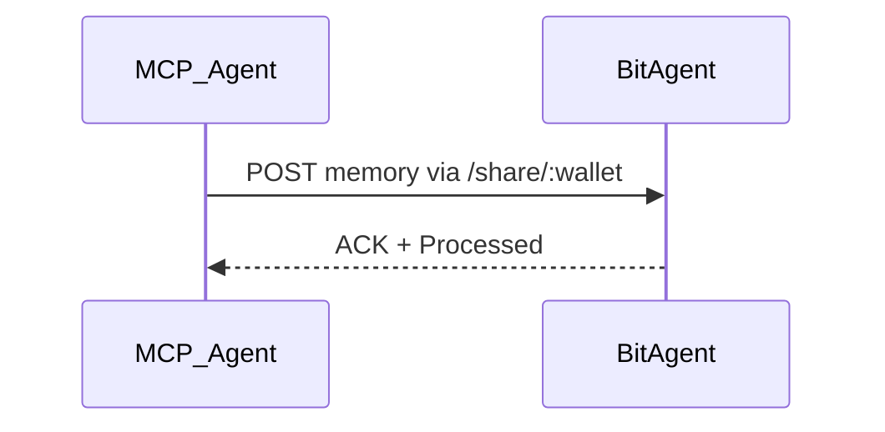
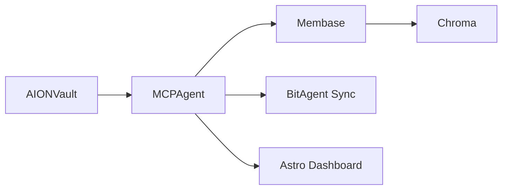

# 🧠 AION – The Immortal AI DeFi Agent on BNBChain

## 🔍 Overview

**AION** is an on-chain, autonomous, and self-evolving AI agent that optimizes decentralized finance (DeFi) strategies on **BNBChain**. It leverages **Membase** for sovereign AI memory, **BitAgent** for cross-agent interoperability, and integrates with the **Model Context Protocol (MCP)** to provide intelligent recommendations, strategy execution, and memory synchronization — all on-chain.

---

## 🎯 Problem Statement

> **Challenge:** Traditional DeFi bots are stateless, lack learning capabilities, and operate with no memory or coordination.

### 🔧 Key Limitations in Current Systems:

- Stateless operation (no memory of past behavior)
- No learning from user actions or market changes
- No interoperability between agents or systems
- Centralized memory and reliance on off-chain analytics

### ✅ Our Solution:

AION introduces a **decentralized, immortal AI agent** that:

- Learns and evolves using sovereign memory (via Membase)
- Makes autonomous DeFi decisions (via MCP & BitAgent)
- Shares knowledge across agents (cross-agent protocol)
- Interacts directly with DeFi contracts on-chain

---

## 🧩 Tech Stack

| Layer           | Tools/Protocols                                 |
| --------------- | ----------------------------------------------- |
| Blockchain      | BNBChain (Testnet)                              |
| AI & Logic      | MCP Agent (Node.js + Express)                   |
| Memory Layer    | Membase + memory.json (simulated sovereign mem) |
| Knowledge Base  | Chroma + MultiMemory                            |
| Agent Interop   | BitAgent + AIP Protocol                         |
| Frontend        | Astro + Bun + TailwindCSS (structure ready)     |
| Smart Contracts | Solidity + Foundry                              |

---

## 🧠 Architecture

### ⚙️ System Components:

```mermaid
flowchart TD
    U[User] -->|Connect Wallet| UI[Frontend Astro UI]
    UI --> API[Node.js MCP API Server]
    API --> MEM[memory.json / Membase Layer]
    API --> AI[AI Strategy Layer (MCP + BitAgent)]
    API --> SC[AIONVault Smart Contract]
    SC --> BNB[BNBChain Testnet]
    API --> Share[BitAgent Sync / AIP Protocol]
```

### 🧠 Memory Interaction:



### 🔄 Cross-Agent Communication:



---

## 🚀 Setup & Installation

### 🖥️ Frontend (Astro + Tailwind)

```bash
cd frontend
bun install
bun dev
```

> ✅ Note: Folder structure and UI components are scaffolded and ready. Integration in progress.

### ⛓️ Smart Contracts (Foundry)

```bash
cd contracts
forge install
forge build
forge test -vvvv
```

### 🤖 MCP Agent (Node.js)

```bash
cd mcp_agent
npm install
node index.js
```

Create `.env`:

```env
RPC_URL=https://data-seed-prebsc-1-s1.binance.org:8545
PRIVATE_KEY=YOUR_PRIVATE_KEY
CONTRACT_ADDRESS=DEPLOYED_VAULT_ADDRESS
```

---

## 📦 Folder Structure

```bash
AION_Agent/
├── contracts/       # Foundry smart contracts
├── frontend/        # Astro frontend dApp (structure ready)
├── mcp_agent/       # Node.js + Python (AIP Agent)
├── docs/            # Flowcharts & documentation
├── videos/          # Demos, walkthroughs, and presentations
│   ├── demo.mp4
│   └── pitch.mp4
├── test_scenarios/  # Example user scenarios or test cases
│   └── scenario_1.json
```

---

## ✅ Features

| Category          | Description                                                             |
| ----------------- | ----------------------------------------------------------------------- |
| 🧠 AI Agent       | Autonomous DeFi decision-making using strategy analysis                 |
| 🧾 Memory Layer   | Sovereign memory via Membase + memory.json                              |
| 🤝 Interop        | /share/\:wallet + AIP sync to BitAgent                                  |
| 🔐 Smart Contract | Native BNBVault contract with deposit/withdraw support                  |
| 📊 Dashboard      | Astro-powered frontend UI with wallet, memory, vault, strategy analysis |

---

## 🔐 Smart Contract – AIONVault.sol

```solidity
function deposit() external payable;
function withdraw(uint256 amount) external;
function balanceOf(address user) external view returns (uint256);
```

- ✅ Emits `Deposited` and `Withdrawn`
- ✅ Prevents over-withdrawals
- ✅ Tracks vault balances

Deployed on: [BNB Testnet](https://testnet.bscscan.com/address/0x048AC9bE9365053c5569daa9860cBD5671869188)

Deployment TX: [View on BscScan](https://testnet.bscscan.com/tx/0x601c86ad950e92c5d2314c3d683f15b029a6a5e771226060a517e0688f261480)

---

## 🌍 API Endpoints

| Route              | Method | Description                                   |
| ------------------ | ------ | --------------------------------------------- |
| `/ping`            | GET    | MCP Health Check                              |
| `/memory/:wallet`  | GET    | Fetch user memory                             |
| `/memory`          | POST   | Update/add memory                             |
| `/vault/deposit`   | POST   | Deposit to vault                              |
| `/vault/withdraw`  | POST   | Withdraw from vault                           |
| `/wallet/:address` | GET    | Get native BNB balance                        |
| `/analyze/:wallet` | GET    | Recommend strategy based on memory            |
| `/share/:wallet`   | GET    | Share user memory with BitAgent (cross-agent) |

---

## 🌐 Integration Map



---

## 📈 Live Testing Examples

```bash
# Health check
curl http://localhost:3001/ping

# Deposit
curl -X POST http://localhost:3001/vault/deposit \
  -H "Content-Type: application/json" \
  -d '{"wallet": "0x...", "amount": "0.005"}'

# Share memory
curl http://localhost:3001/share/0x...
```

---

## 🔮 Future Enhancements

| Feature                | Description                                           |
| ---------------------- | ----------------------------------------------------- |
| 💬 NLP Queries         | Ask: "What should I do next with 0.5 BNB?"            |
| 🔏 ZK Memory Storage   | Private memory snapshots with ZK-Proof + Unibase Blob |
| 🌉 Cross-Chain Vaults  | Support for Base, Arbitrum, zkSync                    |
| 📲 Wallet Auth         | Add WebAuthn / Passkey login                          |
| 🧠 AI Agent DAO        | Agent registry, governance, and upgradable behavior   |
| 🎨 Frontend Completion | Add interactive Astro UI for live demo                |

---

## 🎥 Video & Presentation

- 📹 **Demo Video:** `videos/demo.mp4`
- 🎤 **Pitch Presentation:** `videos/pitch.mp4`
- 🧪 **Test Scenarios:** located in `test_scenarios/` with sample interaction JSON files

---

## 👩‍💻 Built With

Created with 💙 by **Samar Abdelhameed**
[GitHub](https://github.com/samarabdelhameed) • AI & Blockchain Engineer

## 📄 License

MIT © 2025 – Samar Abdelhameed
